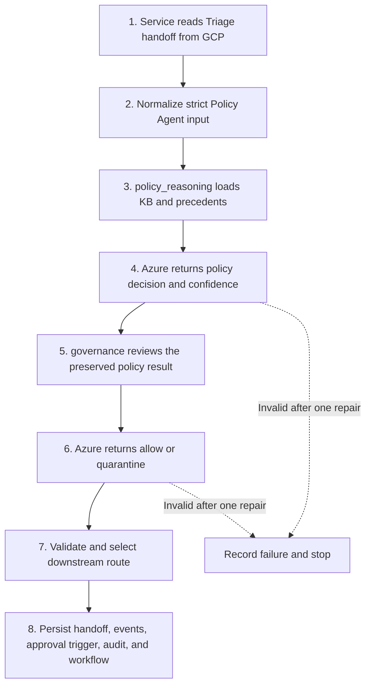
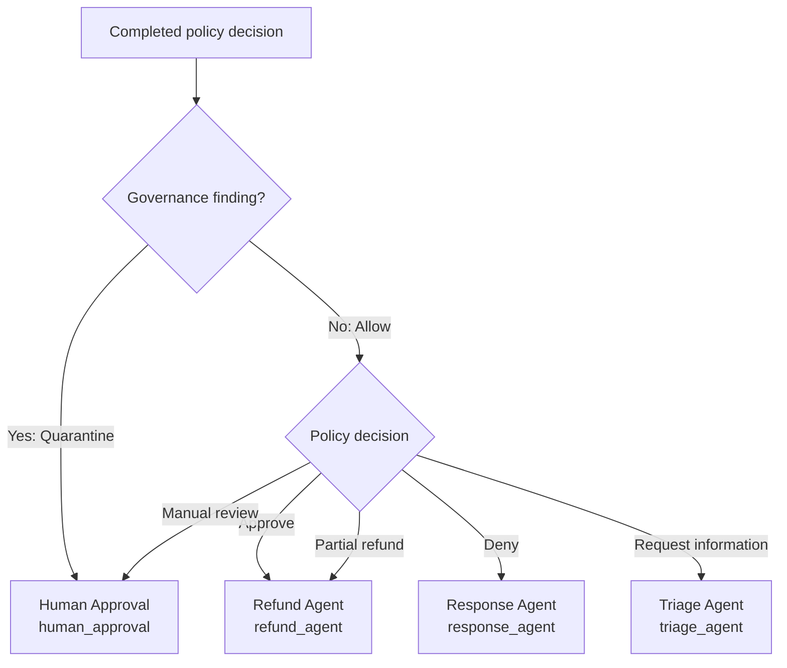

# Policy Agent

The Policy Agent converts a validated Triage Agent handoff into a governed refund-policy decision and downstream handoff. A service layer reads GCP, invokes a two-node LangGraph (`policy_reasoning -> governance`), and transactionally writes the result back to GCP MySQL `main_db`.

The policy node evaluates the versioned knowledge base and optional precedent evidence. The governance node independently returns either `allow` or `quarantine` without changing the policy decision. Azure OpenAI performs both reasoning stages; Python enforces contracts, routing, repair limits, and persistence without substituting a local decision.

## Index

1. [Purpose And Boundary](#1-purpose-and-boundary)
2. [How A Case Is Processed](#2-how-a-case-is-processed)
3. [How Cases Reach Downstream Agents](#3-how-cases-reach-downstream-agents)
4. [Policy Decision Logic](#4-policy-decision-logic)
   1. [Knowledge Base Use](#41-knowledge-base-use)
   2. [Decision Branches](#42-decision-branches)
   3. [Confidence](#43-confidence)
   4. [Precedent Use](#44-precedent-use)
   5. [Governance](#45-governance)
5. [Technical Contracts](#5-technical-contracts)
   1. [Input](#51-input)
   2. [Output](#52-output)
   3. [Validation Repair And Failure](#53-validation-repair-and-failure)
   4. [GCP Persistence](#54-gcp-persistence)
6. [Setup Run And Test](#6-setup-run-and-test)
7. [Where To Modify Behavior](#7-where-to-modify-behavior)
8. [Current Limitations](#8-current-limitations)

## 1. Purpose And Boundary

| Stage | Policy Agent responsibility |
|---|---|
| Receives | Structured request and order facts from `triage_agent` |
| Decides | Applicable refund rules, decision, refund amount, confidence, and response guidance |
| Governs | Semantic drift, forbidden tool claims, and PII risk through `allow` or `quarantine` |
| Produces | A validated output and route to `refund_agent`, `response_agent`, `triage_agent`, or `human_approval` |
| Persists | Handoff, review events, one typed human-approval trigger, audit evidence, tokens, and workflow state |

The component begins after triage has identified and sanitized the case. Refund execution and final customer communication remain downstream responsibilities.

## 2. How A Case Is Processed



`service.py` owns the GCP-to-graph-to-GCP boundary. Inside the compiled graph, `policy_reasoning` produces the complete policy result and usage, then `governance` preserves that result while adding governance, route, and aggregate usage.

## 3. How Cases Reach Downstream Agents

Routing evaluates governance first because `quarantine` overrides every policy decision. When governance returns `allow`, the policy decision selects the downstream bucket.



| Evaluation order | Governance result | Policy decision | Final downstream bucket | Workflow state |
|---:|---|---|---|---|
| `1` | `quarantine` | Any decision | `human_approval` | `pending_human / human_approval` |
| `2` | `allow` | `approve` | `refund_agent` | `running / refund_agent` |
| `2` | `allow` | `partial_refund` | `refund_agent` | `running / refund_agent` |
| `2` | `allow` | `deny` | `response_agent` | `running / response_agent` |
| `2` | `allow` | `request_info` | `triage_agent` | `running / triage_agent` |
| `2` | `allow` | `manual_review` | `human_approval` | `pending_human / human_approval` |

Every human route uses the same `pending_human / human_approval` workflow state. Its cause is preserved separately: a governance escalation uses a `governance` trigger, while a policy review uses a `policy_review` trigger.

## 4. Policy Decision Logic

### 4.1 Knowledge Base Use

`case.policy_version` selects the policy KB and the compatible precedent file. Version `v1.0` uses:

- `data/policy_context_v1.md` as the authoritative refund-policy rules;
- `data/precedent_memory_v1.yaml` as optional, read-only precedent evidence.

Azure receives the normalized input, a structural fact-presence map, the complete KB text, and the validated precedent context. It must cite each applied rule and the input fact used. Python verifies that rule IDs exist, rule effects match their families, evidence uses allowed fact paths, and supporting rules have qualifying evidence.

The current KB organizes cases into four practical groups:

| Policy result | Main `v1.0` conditions |
|---|---|
| Approval | Damaged or wrong item within 30 days; qualifying non-delivery |
| Denial | Delivered dissatisfaction, outside the 30-day window, or a completed duplicate refund |
| Request information | A required reason, amount, or linked order fact is missing |
| Manual review | High value (`requested_amount >= 500` or `amount_paid >= 500`), over-request, prior partial refund, returned item, conflicting facts, or discretionary goodwill |

The KB file is authoritative. This table is only a readable summary.

### 4.2 Decision Branches

The validator applies the following branches in order:

1. **Policy review condition**
   - A `policy_conflict` or matched `R-REVIEW-*` rule produces `manual_review`.
2. **Missing essential fact**
   - The decision becomes `request_info`.
   - Response guidance must name every missing fact path.
3. **No decisive policy support**
   - Confidence becomes `0` and the decision becomes `manual_review`.
4. **Low confidence**
   - Confidence `1` requires `manual_review`.
5. **Actionable policy support**
   - A decisive rule with confidence `2` or `3` produces `approve`, `deny`, or `partial_refund` according to the rule effect.

Amount rules are enforced after the branch is selected:

- `deny`, `request_info`, and `manual_review` require `refund_amount = 0`.
- Approval amounts must be positive and cannot exceed the requested amount or `amount_paid - prior_refund_total`.
- A partial refund must also be less than the requested amount.

### 4.3 Confidence

Confidence is an integer category, not a probability. The actionable threshold is `2`: automated approval, denial, or partial refund requires moderate or high confidence.

| Score | Level | Exact basis | Allowed result |
|---:|---|---|---|
| `3` | `high` | Required facts are present, policy support is clear, no important conflict exists, and precedents do not weaken the decision | Actionable decision or clearly supported `manual_review` |
| `2` | `moderate` | A minor ambiguity exists or relevant precedents are mixed | Actionable decision or `manual_review` |
| `1` | `low` | Policy conflict, weak support, or strong precedent disagreement exists | `manual_review` only |
| `0` | `insufficient` | An essential fact is missing or no relevant policy supports a decision | `request_info` or `manual_review` |

The score is derived sequentially:

1. Missing facts or no policy support -> `0`.
2. Otherwise, policy conflict, weak support, or strong precedent disagreement -> `1`.
3. Otherwise, minor ambiguity or mixed precedents -> `2`.
4. Otherwise -> `3`.

A review rule can produce high-confidence `manual_review`: confidence measures certainty that review is required, not whether the case can be automated. Governance never changes policy confidence.

### 4.4 Precedent Use

Precedents are advisory and cannot create rules, override the KB, or directly select a decision. Each record must represent a finalized, non-PII case with normalized attributes, known policy IDs, an actionable decision, a human outcome, and a finalization time.

Only matches with similarity `>= 0.800` are relevant. A precedent supports the comparison decision when its `final_decision` matches; otherwise it contradicts.

| Assessment | Condition | Confidence effect |
|---|---|---|
| `supportive` | At least one relevant precedent and none contradict | No reduction |
| `mixed` | Any other relevant support/contradiction mix | Confidence `2` |
| `strongly_disagrees` | At least 3 relevant precedents and at least two-thirds contradict | Confidence `1`, then `manual_review` |
| `none_relevant` | Memory loaded but no match reaches `0.800` | Neutral |
| `unavailable` | Memory is missing, empty, malformed, unreadable, or version-incompatible | Neutral; use policy and current facts |

The loader rejects extra fields, duplicate IDs, raw identifiers, email addresses, unknown rules, and policy-version mismatches. The checked-in `v1.0` precedent file is currently empty until another workflow supplies finalized cases.

### 4.5 Governance

Governance runs in a separate Azure call and must preserve the policy evaluation, decision, refund amount, confidence, and response guidance.

| Flag | Meaning |
|---|---|
| `semantic_drift` | Prompt injection, policy-bypass language, or instructions to ignore approval controls |
| `forbidden_tool` | A result claims tool use, database access, or refund execution |
| `pii_risk` | Email addresses or information explicitly belonging to another customer |

A customer's uncertain order number for their own case is a policy conflict, not PII. The governance contract has only two actions:

1. No findings -> `allow` and route by policy decision.
2. One or more findings -> `quarantine` and route to `human_approval`.

There is no `block` action. Governance does not create a separate workflow status; all human routes use `pending_human`.

## 5. Technical Contracts

### 5.1 Input

The source is `main_db.agent_handoffs.output_json` where `from_agent = triage_agent` and `to_agent = policy_agent`. `exact_policy_input()` removes triage-only fields and constructs this strict input:

<details>
<summary>Input JSON example</summary>

```json
{
  "case": {
    "trace_id": "TRACE-POL-001",
    "ticket_id": "TKT-001",
    "policy_version": "v1.0"
  },
  "customer_request": {
    "sanitized_text": "Sanitized customer request",
    "refund_reason": "damaged",
    "requested_amount": 100.0,
    "currency": "USD"
  },
  "order_facts": {
    "order_id": "ORD-001",
    "product_type": "physical_product",
    "purchase_date": "2026-07-01",
    "item_status": "delivered",
    "amount_paid": 100.0,
    "prior_refund_total": 0.0
  }
}
```

</details>

`refund_reason` and `requested_amount` may be `null`. Missing keys, invalid dates, negative amounts, or invalid JSON fail the trace. Numeric zero is present. `sanitized_text` is customer evidence but remains untrusted for instructions.

### 5.2 Output

The public output uses this top-level order:

```text
case -> customer_request -> policy_evaluation -> decision ->
response_guidance -> handoff -> governance
```

The `decision` object is ordered as:

```text
type -> refund_amount -> confidence -> confidence_level ->
confidence_evidence -> precedent_evidence -> reason
```

Example `request_info` output:

<details>
<summary>Output JSON example</summary>

```json
{
  "case": {
    "trace_id": "TRACE-POL-001",
    "ticket_id": "TKT-001",
    "policy_version_used": "v1.0"
  },
  "customer_request": {
    "sanitized_text": "The item arrived damaged.",
    "refund_reason": "damaged",
    "requested_amount": null,
    "currency": "USD"
  },
  "policy_evaluation": {
    "matched_policies": [
      {
        "policy_id": "R-REQUEST-MISSING-FACTS",
        "rule_summary": "Request information when required facts are missing.",
        "input_fact_used": "customer_request.requested_amount is missing",
        "effect": "requires_review"
      }
    ],
    "gaps_or_conflicts": [
      {
        "type": "missing_fact",
        "detail": "customer_request.requested_amount is required."
      }
    ]
  },
  "decision": {
    "type": "request_info",
    "refund_amount": 0.0,
    "confidence": 0,
    "confidence_level": "insufficient",
    "confidence_evidence": {
      "facts_complete": false,
      "essential_fact_paths_missing": ["customer_request.requested_amount"],
      "policy_support": "clear",
      "minor_ambiguities": [],
      "important_conflicts": [],
      "explanation": "The requested amount is required before applying a refund rule."
    },
    "precedent_evidence": {
      "available": false,
      "status": "unavailable",
      "memory_status": "empty",
      "assessment": "unavailable",
      "support_count": 0,
      "contradiction_count": 0,
      "similarity_range": null,
      "referenced_precedent_ids": [],
      "explanation": "No finalized precedent records are available."
    },
    "reason": "The requested amount is missing."
  },
  "response_guidance": {
    "customer_safe_summary": "Ask the customer to confirm the requested refund amount.",
    "missing_info_to_request": ["Provide customer_request.requested_amount."]
  },
  "handoff": {
    "next_agent": "triage_agent",
    "reason": "Triage must collect the missing requested amount."
  },
  "governance": {
    "semantic_drift_score": 0.0,
    "interceptor_action": "allow",
    "flags": []
  }
}
```

</details>

`case` and `customer_request` must preserve the input. `policy_evaluation` contains matched rules and gaps; `response_guidance` contains a customer-safe summary and any missing facts to request; `handoff.next_agent` must match the routing table; and `governance` contains the drift score, interceptor action, and flags.

The internal policy result also contains an evidence manifest for rule IDs, fact paths, precedent matches, and decision support. Detailed governance findings are persisted as events. Neither internal structure is added to the public output.

The exact schemas and field constraints are defined in `models.py`; the tested complete examples are produced by `tests/factories.py`.

### 5.3 Validation Repair And Failure

Both Azure nodes must return strict JSON. Python validates:

1. Schema and input binding.
2. Policy IDs, effects, evidence, and allowed fact paths.
3. Confidence and precedent calculations.
4. Decision precedence and refund limits.
5. Governance preservation and routing.

An invalid result receives one Azure repair call with the validation errors and validator-calculated constraints. Repair can replace only existing JSON Pointer paths; policy-confidence repair must return the complete confidence and precedent correction. Python applies only the returned values and validates the full result again.

If repair remains invalid, the service records `policy_agent_failed`, sets the workflow to `failed / policy_agent`, creates no downstream handoff, and stops. There is no local reasoning, governance, routing, or persistence fallback.

### 5.4 GCP Persistence

A successful trace is written in one MySQL transaction. Persistence follows this order:

1. Upsert the Policy Agent handoff and aggregate Azure token totals.
2. Replace the trace's policy-review and governance events with the current validated events.
3. Create or refresh human approval only when `next_agent = human_approval`.
4. Write the audit payload and update the workflow route.
5. Commit everything together; any error rolls the transaction back.

| Table | Stored result |
|---|---|
| `agent_handoffs` | Normalized input, final output, downstream agent, and aggregate Azure tokens |
| `policy_review_events` | Rule or low-confidence evidence for `manual_review` |
| `governance_events` | One event per governance finding and its OWASP category |
| `human_approvals` | Pending approval with one typed governance or policy-review trigger |
| `audit_log` | Output, token use, internal evidence manifest, and precedent status |
| `workflow_runs` | Policy version, workflow status, and current agent |

Token totals include policy reasoning, governance, and repair calls. Costs are not stored. A failed success transaction is rolled back; failure audit and workflow state are then written separately.

The human approval stores exactly one typed reference: `triggering_event_type` identifies how to interpret `triggering_event_id`.

- `governance` references `governance_events.event_id`;
- `policy_review` references `policy_review_events.policy_review_event_id`.

If both event types exist, governance becomes the single approval trigger because safety escalation takes precedence; the policy-review event remains supporting evidence. This replaces the former pair of nullable governance and policy-review references. Because one identifier can point to either parent table, MySQL does not enforce a single foreign key; repository persistence and schema/integrity checks validate the typed reference.

## 6. Setup Run And Test

### 6.1 Setup

From `customer-refund-service`:

```powershell
python -m pip install -r policy_agent\requirements.txt
Copy-Item policy_agent\.env.example policy_agent\.env
python -m policy_agent.cli migrate --confirm main_db
python -m policy_agent.cli check
```

`migrate` applies both Policy Agent migrations in order: `001_policy_governance_separation.sql` separates policy-review evidence from governance events, and `002_unified_human_approval_trigger.sql` replaces split approval references with the required typed trigger.

Configure Azure OpenAI and GCP MySQL in the ignored `policy_agent/.env`. Existing environment variables take precedence. `AZURE_OPENAI_API_VERSION` must be `2025-03-01-preview` or later; temperature defaults to `0`.

### 6.2 Run

```powershell
python -m policy_agent.cli run --pending
python -m policy_agent.cli run --trace TRACE-POL-001
python -m policy_agent.cli run --all
```

- `--pending`: process workflows waiting at `policy_agent`.
- `--trace`: process one trace.
- `--all`: reprocess every Triage-to-Policy handoff.

All run commands call Azure and write GCP.

### 6.3 Test

The normal suite uses fake Azure responses and does not write GCP:

```powershell
python -m pytest policy_agent\tests -q -m "not live"
python -m compileall -q policy_agent
python -m policy_agent.cli check
git diff --check
```

The live 20-case test calls Azure, resets Policy Agent artifacts for `TRACE-POL-001` through `TRACE-POL-020`, and writes GCP. Run it only when that benchmark reset is intended:

```powershell
$env:RUN_POLICY_AGENT_LIVE_TESTS = "1"
python -m pytest policy_agent\tests\test_cloud_pipeline_20_cases.py -q -m live
Remove-Item Env:RUN_POLICY_AGENT_LIVE_TESTS
```

## 7. Where To Modify Behavior

Prompts, validators, models, and tests must remain synchronized. Changing only prompt wording does not change the enforced contract.

| Intended change | Primary location | Also update |
|---|---|---|
| Refund rules, windows, review thresholds, or precedence | `data/policy_context_v1.md` | Affected tests; create a new version when compatibility must be preserved |
| New policy version | New KB and precedent files under `data/` | `POLICY_CONTEXTS` and `PRECEDENT_CONTEXTS` in `policy_node.py`; tests |
| Input or public output fields | `models.py` | `exact_policy_input()`, prompts, persistence, upstream/downstream contracts, tests |
| Confidence meanings or decision branches | `_policy_instructions()`, `_confidence_expectation()`, and `_validate_decision()` in `policy_node.py` | `PolicyDecision` in `models.py`; confidence tests; README |
| Precedent thresholds | Constants at the top of `policy_node.py` | Prompt wording, validator tests, README |
| Governance flags | Governance types in `models.py` | `governance_node.py`, `OWASP_BY_FLAG` in `cloud_db.py`, schema if needed, tests |
| Downstream routes | Route validators in `models.py` and `governance_node.py` | Governance prompt, `_workflow_state()` in `cloud_db.py`, downstream contracts, tests, diagrams |
| Human approval trigger model | `_approval_trigger()` and persistence in `cloud_db.py` | `002_unified_human_approval_trigger.sql`, schema checks, reset logic, cloud tests |
| Graph topology | `graph.py` | State contracts, `service.py`, graph tests, diagrams |
| Azure generation or repair | `azure.py` | `.env.example` and repair tests |
| GCP tables or transactions | `cloud_db.py` | SQL under `migrations/`, schema checks, reset logic, live tests |
| CLI operations | `cli.py` | Command examples and operational tests |

File ownership is intentionally separated:

- `policy_node.py`: policy, confidence, and precedent reasoning.
- `governance_node.py`: OWASP review and route selection.
- `models.py`: strict input/output contracts and invariants.
- `azure.py`: structured Azure generation and repair.
- `graph.py`: LangGraph node order.
- `service.py`: GCP-to-graph-to-GCP orchestration.
- `cloud_db.py`: GCP schema, state, and transactions.
- `migrations/001_*.sql`: separate policy-review evidence and approval routing columns.
- `migrations/002_*.sql`: unify human approval around one typed trigger.
- `cli.py`: operational commands.

## 8. Current Limitations

1. Triage-provided facts are trusted as correctly linked and sanitized; the Policy Agent does not query source systems.
2. The checked-in precedent memory is empty and there is no vector search or Qdrant integration.
3. Python verifies structure, references, arithmetic, and branch consistency but cannot independently prove every Azure semantic judgment.
4. `partial_refund` is supported by the contract and routing, but the current `v1.0` KB sends discretionary partial outcomes to human review.
5. The polymorphic human-approval trigger is validated by repository logic rather than one database foreign key.
6. Concurrency, refund execution, customer-response quality, and final human outcomes remain outside this component.
